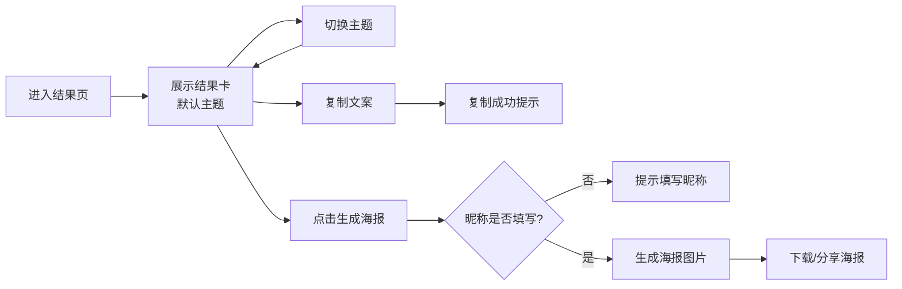

## 1. 产品概述

测评结果卡是一款为用户提供个性化测评结果展示的前端组件，将 AI 生成的人设称号、宿命金句和趣味标签以精美视觉呈现，支持一键生成海报与复制文案，满足用户分享至社交平台的需求。

- 目标用户：完成心理/性格/趣味测评的用户
- 核心价值：将测评结果转化为具有传播性的视觉内容
- 产品定位：刷屏级测评结果展示组件

## 2. 核心功能

### 2.1 功能模块

1. **结果卡展示**：人设称号、宿命文案、趣味标签、用户头像与昵称
2. **主题切换**：赛博朋克、治愈系、复古风三套视觉主题
3. **海报生成**：一键导出结果卡为图片格式
4. **文案复制**：一键复制测评结果文案
5. **昵称校验**：生成海报前检查昵称是否填写

### 2.2 功能详情

| 模块名称 | 功能描述 | 交互细节 |
|---------|---------|---------|
| 人设称号 | 展示用户专属人设称号 | 大号字体，居中展示，主题联动样式 |
| 宿命文案 | 展示年度宿命金句 | 超过40字截断显示，悬停显示全文，带省略号 |
| 趣味标签 | 展示至少五个趣味标签 | 按权重从大到小排列，标签样式随主题变化 |
| 主题切换 | 三套视觉主题切换 | 卡片配色与字体联动变化，平滑过渡动画 |
| 海报导出 | 将结果卡导出为图片 | 导出前检查昵称，未填写提示用户 |
| 文案复制 | 复制测评结果文案 | 点击复制，复制成功反馈提示 |
| 头像展示 | 用户头像展示 | 加载失败时显示默认占位图 |

## 3. 核心流程

用户完成测评后进入结果页 → 查看测评结果卡（默认主题）→ 可切换不同主题 → 可复制文案 → 点击生成海报（检查昵称）→ 生成成功后可下载分享

## 4. 用户界面设计

### 4.1 设计风格

三套视觉主题，各具特色：

**赛博朋克主题**
- 主色调：霓虹紫、电光蓝、荧光粉
- 字体：科技感无衬线字体
- 元素：发光效果、故障艺术、渐变边框
- 氛围：未来感、科技感、炫酷

**治愈系主题**
- 主色调：柔和粉、薄荷绿、奶油白
- 字体：圆润可爱字体
- 元素：柔和渐变、柔光效果、圆角
- 氛围：温暖、舒适、治愈

**复古风主题**
- 主色调：焦糖棕、米黄、墨绿
- 字体：衬线字体、复古打字机风格
- 元素：做旧纹理、胶片质感、装饰线条
- 氛围：怀旧、文艺、经典

### 4.2 页面布局

| 区域 | 内容 | 布局方式 |
|------|------|---------|
| 顶部 | 主题切换按钮 | 右上角水平排列 |
| 卡片主体 | 头像、昵称、人设称号、宿命文案、标签 | 垂直居中排列 |
| 底部操作区 | 复制文案、生成海报按钮 | 水平排列 |

卡片采用纵向布局，内容居中对齐，有充足的留白和呼吸感。卡片有阴影和圆角，呈现悬浮感。

### 4.3 响应式设计

- 桌面端：卡片固定宽度，居中展示
- 移动端：卡片自适应屏幕宽度，左右留边距
- 触控优化：按钮最小触控区域 44x44px

### 4.4 动效设计

- 主题切换：颜色平滑过渡动画 0.3s
- 标签入场：错落淡入动画
- 按钮悬停：缩放 + 阴影变化
- 复制成功：弹出提示动画
