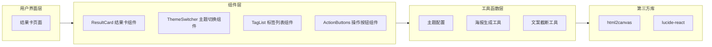

## 1. 架构设计



## 2. 技术描述

- **前端框架**：React@18 + TypeScript
- **构建工具**：Vite@5
- **样式方案**：TailwindCSS@3 + CSS 变量
- **状态管理**：React useState / useContext（轻量场景）
- **海报生成**：html2canvas
- **图标库**：lucide-react

### 2.1 项目结构

```
src/
├── components/
│   ├── ResultCard/          # 结果卡主组件
│   │   ├── ResultCard.tsx   # 主组件
│   │   ├── ThemeSwitcher.tsx # 主题切换
│   │   ├── TagList.tsx      # 标签列表
│   │   └── ActionButtons.tsx # 操作按钮
│   └── UI/                  # 基础UI组件
├── hooks/
│   └── useTheme.ts          # 主题管理Hook
├── utils/
│   ├── themes.ts            # 主题配置
│   ├── poster.ts            # 海报生成工具
│   └── text.ts              # 文本处理工具
├── types/
│   └── index.ts             # 类型定义
├── pages/
│   └── ResultPage.tsx       # 结果页
├── App.tsx
├── main.tsx
└── index.css
```

## 3. 数据模型

### 3.1 测评结果数据

```typescript
interface AssessmentResult {
  personaTitle: string;      // 人设称号
  destinyText: string;       // 宿命文案
  tags: TagItem[];           // 趣味标签列表
  userAvatar: string;        // 用户头像URL
  nickname: string;          // 用户昵称
}

interface TagItem {
  id: string;
  text: string;              // 标签文本
  weight: number;            // 权重（用于排序）
}
```

### 3.2 主题配置

```typescript
type ThemeType = 'cyber' | 'healing' | 'retro';

interface ThemeConfig {
  name: string;
  colors: {
    background: string;      // 卡片背景
    backgroundGradient?: string; // 渐变背景
    textPrimary: string;     // 主文字色
    textSecondary: string;   // 次文字色
    accent: string;          // 强调色
    accentSecondary: string; // 次强调色
    tagBg: string;           // 标签背景
    tagText: string;         // 标签文字
    border: string;          // 边框色
    shadow: string;          // 阴影色
  };
  fonts: {
    title: string;           // 标题字体
    body: string;            // 正文字体
  };
  borderRadius: {
    card: string;            // 卡片圆角
    tag: string;             // 标签圆角
    button: string;          // 按钮圆角
  };
}
```

## 4. 核心功能实现方案

### 4.1 主题切换

使用 CSS 变量 + React Context 实现主题切换，三套主题配置独立管理，切换时动态更新 CSS 变量。

### 4.2 海报生成

使用 html2canvas 将结果卡 DOM 元素转换为 Canvas，再导出为 PNG 图片。生成前校验昵称是否为空。

### 4.3 文案截断

使用 CSS text-overflow: ellipsis 实现基础截断，结合 Tooltip 组件实现悬停显示全文。

### 4.4 头像容错

监听 img 元素的 onerror 事件，加载失败时替换为默认占位图。

## 5. 性能与体验优化

- 主题切换使用 CSS transition 实现平滑过渡
- 海报生成时显示加载状态
- 复制功能使用 Clipboard API，提供成功反馈
- 响应式布局适配移动端
